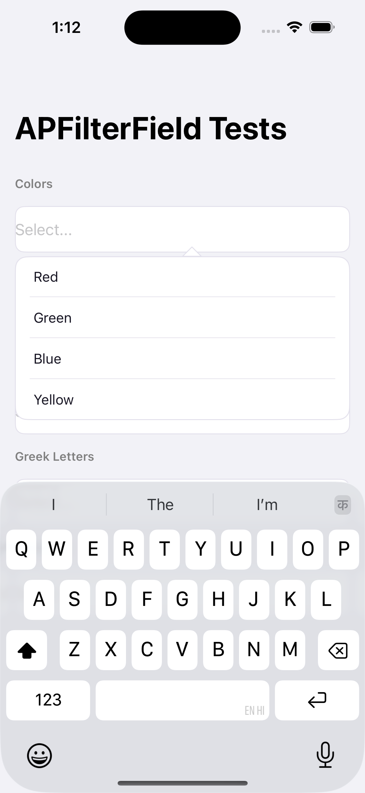
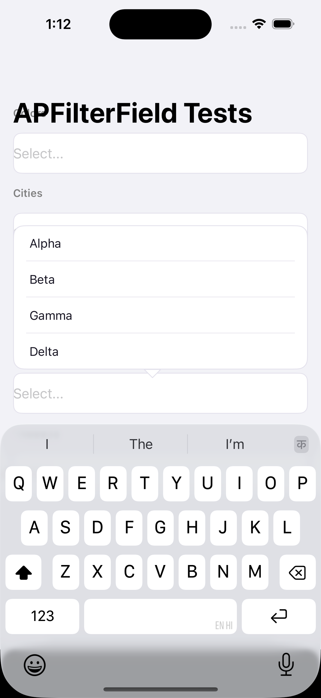
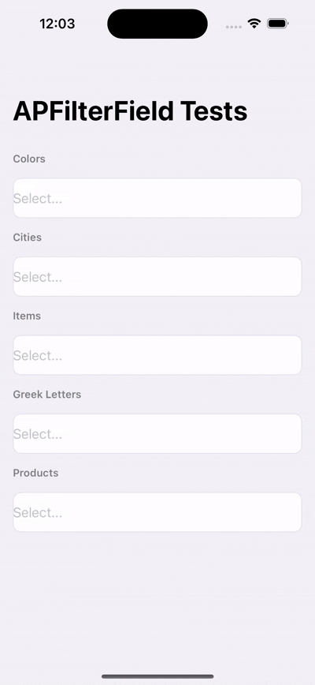

<p align="center">
  <h1 align="center">APFilterTextField</h1>
</p>

<p align="center">A drop-in UITextField with a live, keyboard-aware, type-ahead filter dropdown.</p>

<p align="center">
  
  
  
  <a href="LICENSE"></a>
</p>

---

## Preview

| Below placement | Above placement (keyboard avoidance) | Live filtering |
| :---: | :---: | :---: |
|  |  |  |

## Table of Contents

- [Features](#features)
- [Requirements](#requirements)
- [Installation](#installation)
- [Quick Start](#quick-start)
- [Usage](#usage)
  - [Creating a field](#creating-a-field)
  - [Providing options](#providing-options)
  - [Handling selection](#handling-selection)
  - [Using Interface Builder](#using-interface-builder)
  - [Updating options while the field is in use](#updating-options-while-the-field-is-in-use)
- [API Reference](#api-reference)
  - [`APFilterField`](#apfilterfield)
  - [`APFilterFieldDelegate`](#apfilterfielddelegate)
  - [`FieldOption`](#fieldoption)
- [How positioning works](#how-positioning-works)
- [License](#license)

## Features

- [x] Live, type-ahead filtering dropdown anchored to a `UITextField`
- [x] Automatically flips above/below the field depending on available space when the keyboard appears
- [x] Shifts the host screen up just enough to keep the field and dropdown clear of the keyboard
- [x] Supports both portrait and landscape, with independently configurable row counts for each
- [x] Dismisses on outside tap or pan, without swallowing the tap on the field itself
- [x] Fully stylable - corners, borders, colors, fonts, row count - via `@IBInspectable` properties
- [x] Works from Interface Builder or entirely in code
- [x] Simple delegate protocol with sensible defaults - implement only what you need
- [x] No third-party dependencies

## Requirements

| | |
|---|---|
| **iOS** | 9.0+ |
| **Swift** | 4.0+ |
| **Frameworks** | UIKit |

## Installation

### Manually

Drag these four files into your Xcode project (make sure **Copy items if needed** is checked):

```
APFilterField.swift
FloatingFilterView.swift
FieldOption.swift
PassthroughContainerView.swift
```

### Swift Package Manager

You can consume this via SPM.

## Quick Start

```swift
import UIKit

class ViewController: UIViewController {

    @IBOutlet weak var stateField: APFilterField!

    let states = [
        FieldOption(id: "ca", value: "California"),
        FieldOption(id: "co", value: "Colorado"),
        FieldOption(id: "ct", value: "Connecticut")
    ]

    override func viewDidLoad() {
        super.viewDidLoad()
        stateField.options = states
        stateField.filterDelegate = self
    }
}

extension ViewController: APFilterFieldDelegate {
    func filterField(_ field: APFilterField, didSelect option: FieldOption) {
        print("Selected:", option.value)
    }
}
```

Focusing the field shows the dropdown; typing filters it live; tapping a row (or anywhere outside the field/dropdown) dismisses it.

## Usage

### Creating a field

In code:

```swift
let field = APFilterField(frame: CGRect(x: 0, y: 0, width: 280, height: 44))
view.addSubview(field)
```

Or in Interface Builder: drag a `UITextField` onto your view, then set its custom class to `APFilterField` in the Identity Inspector.

### Providing options

```swift
field.options = [
    FieldOption(id: "1", value: "Apple"),
    FieldOption(id: "2", value: "Banana"),
    FieldOption(id: "3", value: "Cherry")
]
```

Set `options` before the field is first focused so the dropdown has data as soon as it appears.

### Handling selection

Adopt `APFilterFieldDelegate` and implement whichever methods you need - everything except `didSelect` has a default no-op implementation:

```swift
extension ViewController: APFilterFieldDelegate {
    func filterField(_ field: APFilterField, didSelect option: FieldOption) {
        // Required - react to the user's pick
    }

    func filterField(_ field: APFilterField, shouldSelect option: FieldOption) -> Bool {
        // Optional - return false to reject a selection (e.g. a disabled option)
        return true
    }

    func filterField(_ field: APFilterField, didChangeText text: String) {
        // Optional - called on every keystroke
    }
}
```

### Using Interface Builder

All appearance properties are `@IBInspectable` and configurable directly in the Attributes Inspector: `showsOnFocus`, `fillsOnSelect`, `dismissesOnSelect`, `fieldCornerRadius`, `fieldBorderWidth`, `fieldBorderColor`, `fieldBackgroundColor`, `fieldTextColor`, `dropdownCornerRadius`, `dropdownBorderColor`.

An exception has to be set in code:
- `filterItemFont`

### Updating options while the field is in use
 
Setting `options` alone only takes effect the next time the dropdown opens:
 
```swift
field.options = updatedOptions
```
 
If the dropdown might **already be open** - for example, options arriving from a network call while the user is mid-search - call `reloadOptions()` right after to push the change into the visible list immediately:
 
```swift
field.options = updatedOptions
field.reloadOptions()
```
 
`reloadOptions()` re-applies whatever text the user has currently typed, so an in-progress search stays filtered correctly instead of snapping back to the full list. It's safe to call even when the dropdown is closed - it just refreshes the off-screen state for the next time it opens, so you don't need to check `isOpen` before calling it.

## API Reference

### `APFilterField`

A `UITextField` subclass (`@IBDesignable`, `open`).

**Data**

| Property | Type | Default | Description |
|---|---|---|---|
| `options` | `[FieldOption]` | `[]` | The full list of selectable options |
| `filterDelegate` | `APFilterFieldDelegate?` (weak) | `nil` | Receives selection and lifecycle callbacks |

**Behavior**

| Property | Type | Default | Description |
|---|---|---|---|
| `showsOnFocus` | `Bool` | `true` | Show the dropdown automatically when the field becomes first responder |
| `fillsOnSelect` | `Bool` | `true` | Set the field's text to the selected option's value |
| `dismissesOnSelect` | `Bool` | `true` | Resign first responder after a selection |

**Field appearance**

| Property | Type | Default | Description |
|---|---|---|---|
| `fieldCornerRadius` | `CGFloat` | `13` | Corner radius of the field itself |
| `fieldBorderWidth` | `CGFloat` | `1` | Border width of the field itself |
| `fieldBorderColor` | `UIColor` | light gray | Border color of the field itself |
| `fieldBackgroundColor` | `UIColor` | `.white` | Background color of the field itself |
| `fieldTextColor` | `UIColor` | near-black | Text color of the field itself |

**Dropdown appearance**

| Property | Type | Default | Description |
|---|---|---|---|
| `filterItemFont` | `UIFont` | system 15pt | Font used for dropdown rows (code only, see above) |
| `dropdownCornerRadius` | `CGFloat` | `13` | Corner radius of the dropdown panel |
| `dropdownBorderColor` | `UIColor` | light gray | Border color of the dropdown panel |
| `numberOfCellsToShow` | `CGFloat` | `4` | Max visible rows in portrait before the list scrolls |
| `numberOfCellsToShowInLandscape` | `CGFloat` | `2` | Max visible rows in landscape before the list scrolls |

### `APFilterFieldDelegate`

| Method | Required? | Called when |
|---|---|---|
| `filterField(_:didSelect:)` | **Yes** | User taps an option |
| `filterField(_:didChangeText:)` | No | Field's text changes |
| `filterField(_:shouldSelect:) -> Bool` | No (defaults `true`) | Before a selection is committed |
| `filterField(_:didShowOptions:)` | No | Dropdown appears |
| `filterField(_:didDismissOptions:)` | No | Dropdown disappears |

**Methods**
 
| Method | Description |
|---|---|
| `reloadOptions()` | Pushes the current `options` array into the dropdown, re-applying any text the user has already typed. Call this after mutating `options` if the dropdown might already be open - safe to call at any time, including while it's closed. |

### `FieldOption`

```swift
public struct FieldOption {
    public let id: String
    public let value: String
}
```

`value` is what's displayed in the dropdown row and, if `fillsOnSelect` is on, what gets written into the field's text. `id` is yours to use for matching the selection back to your own data.

## How positioning works

When the keyboard is about to appear, the field measures its own position against the incoming keyboard frame and decides whether the dropdown fits below it or needs to flip above it. It then shifts the host screen up just enough to keep both the field and the dropdown clear of the keyboard, and reverts that shift when the keyboard hides.

## License

This project is licensed under the MIT License - see the [LICENSE](LICENSE) file for details.

---

Created by Akash.